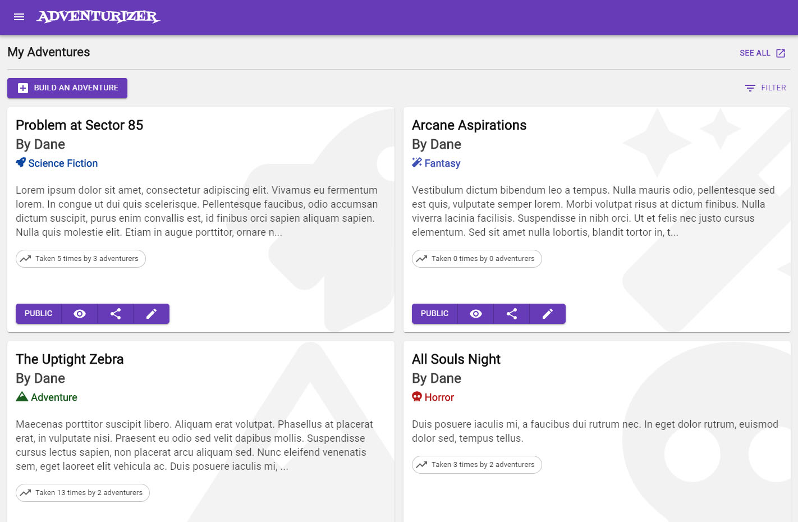
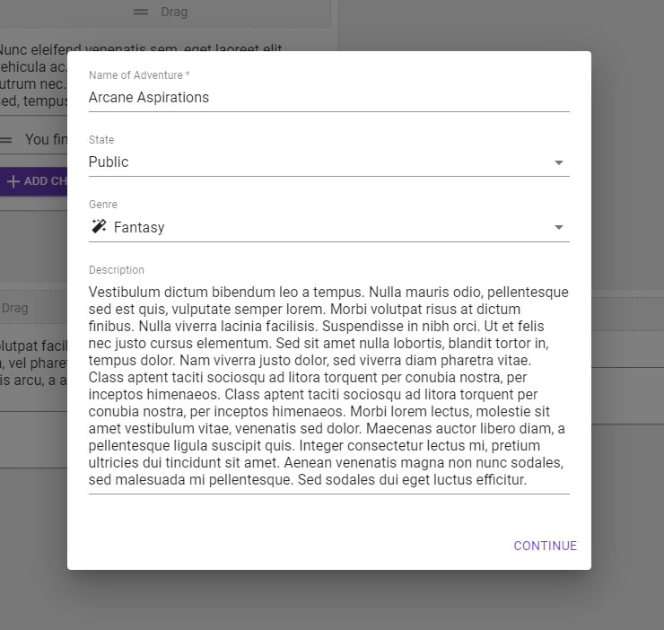
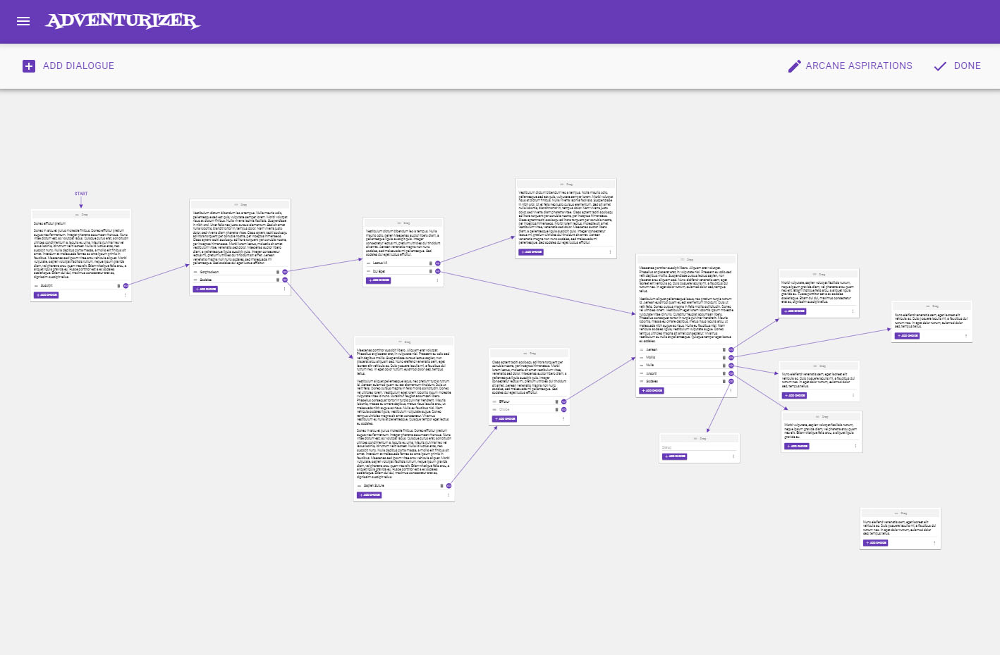
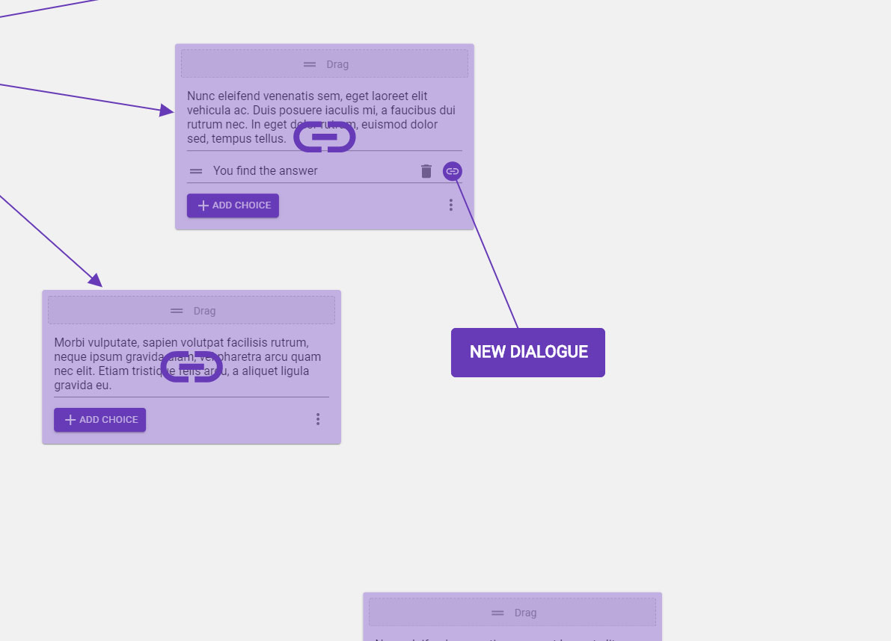
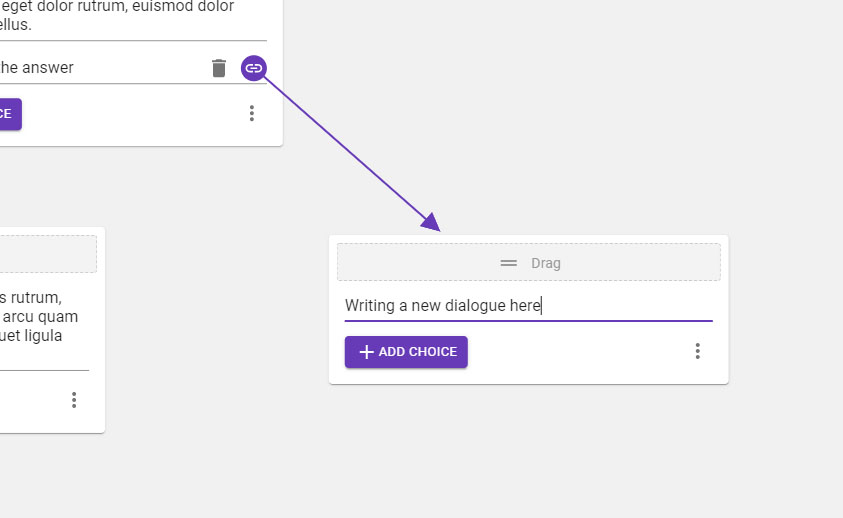
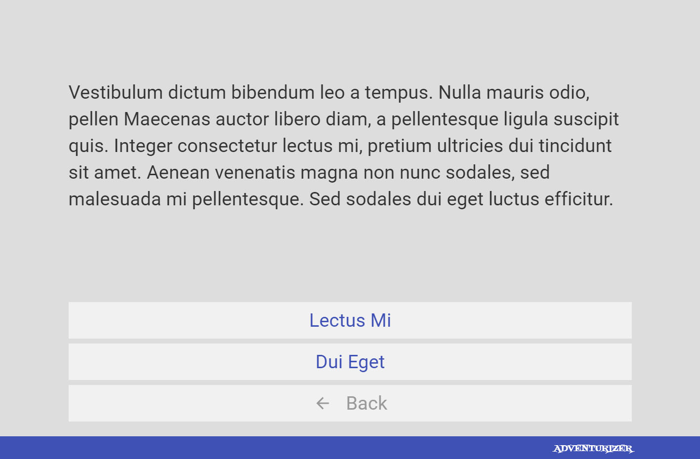
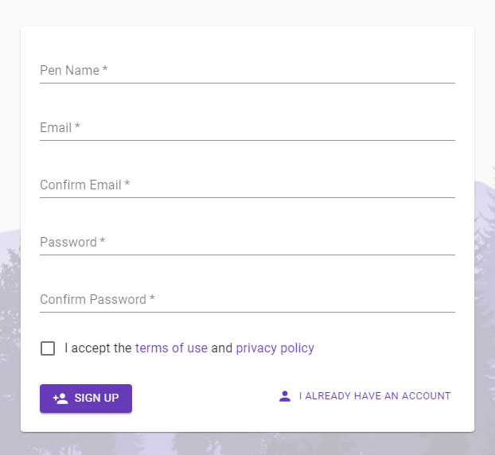

# [Adventurizer](https://adventurizer.net)

Adventurizer is a demo project created by Dane Iracleous. 

Adventurizer is a website that allows users to create and publicize their own web-based text-based choose-your-own-adventures. It also allows users to find and go on other users' adventures.

## Features

* User account creation and management
  * Signup
  * Login
  * Email address verification
  * Forgot/reset password
  * Email receiving opt in and opt out
  * Email address updating
  * Password updating
* Finding and going on adventures
  * User can see a list of all adventures that exist on the platform created by other users and sort by trending, popular, or newest. 
  * User can begin taking an adventure, leave, and them come back to resume where they left off.
* Creating and editing adventures
  * User creates adventures using the drag-and-drop builder
    * Each dialogue has a list of possible choices
    * Each choice routes to another dialogue
    * If a dialogue has no choices, then it's a possible end to the adventure
    * There is no limit to the number of choices for each dialogue
    * There is no limit to the number of dialogues
    * There is no limit to the number of choices that can point to a single dialogue
    * Each adventure also has meta-data: A name, genre, state (public or draft), and description
  * User can edit their adventures, which takes them back into the builder right where they left off (including drag/zoom positions)
  * User can see how many other users have gone on their adventures
  * User can share their adventures to Facebook

## Technicals

Adventurizer is a:
  * Single-page React JS app on the frontend, deployed to AWS S3 as a static website
    * Redux
    * Material UI
    * SASS
  * Python Flask REST API on the backend, deployed to an EC2 instance through Elastic Beanstalk
  * MongoDB database hosted on Atlas

Each component of Adventurizer exists and is deployed separately through deployment scripts in this repository. 

**Note that you will not be able to actually develop since this is just a demo of a project and the sensitive backend/config.py file containing keys and passwords is excluded from the repo. The rest of this readme ignores this fact.**

## Setting yourself up for development

The following information will get you set up to develop locally

### Installing system and software prerequisites

  * Windows (the deployment script is currently only written in a batch file)
  * NPM version 6.13.7
  * Node version 13.9.0
  * Python version 3.6.4
  * Git
  * AWS CLI
  * EB CLI

### Creating your working directory

  1. Create a new directory called "adventurizer" `mkdir adventurizer`
  1. Go into the new directory `cd adventurizer`
  1. Clone the repo into this directory `git clone https://github.com/diracleo/adventurizer.git .`
  1. Create the API server
      1. Create the Python virtual environment `py -3 -m venv venv`
      1. Activate it `venv\Scripts\activate`
      1. Install Flask `pip install Flask`

Setup is now complete and you can begin development.

## Beginning development

Follow the instructions in this section every time you develop.

  1. Go into the directory you created in the previous section if you're not already in there `cd adventurizer`
  1. Pull latest changes from the repo `git pull origin master`
  1. Run the begin development script `begin`
      * The React app will start in development mode in a new command window. Leave this open.
      * The Python Flask API server will start in a new command window. Leave this open. You'll be able to observe all HTTP requests here.
      * Your browser will open a new tab with the URL http://localhost:3000/
  1. Start coding! Making changes to files will reflect in real time at http://localhost:3000/

## Pushing changes to the repository

  1. Go into your working directory if you're not already in there `cd adventurizer`
  1. Add all changed files `git add *`
  1. Commit changes `git commit -m "your message"`
  1. Push changes `git push origin master`

## Deploying changes to production server

Following the instructions in this section will upload the code currently running on your system to the production server at adventurizer.net

  1. Go into your working directory if you're not already in there `cd adventurizer`
  1. Run the deployment script `deploy`
      * To deploy only to the React frontend, run `deploy frontend`
      * To deploy only to the API server, run `deploy backend`
      * Some new command windows will pop up. Leave them open.

## Screenshots

#### Logged-in dashboard 

#### Changing the meta data of an adventure

#### Zoomed out view of all dialogues and choices in an adventure

#### Linking and placing a new dialogue from an existing choice

#### Writing the newly placed dialogue

#### Taking an adventure

#### Signup
